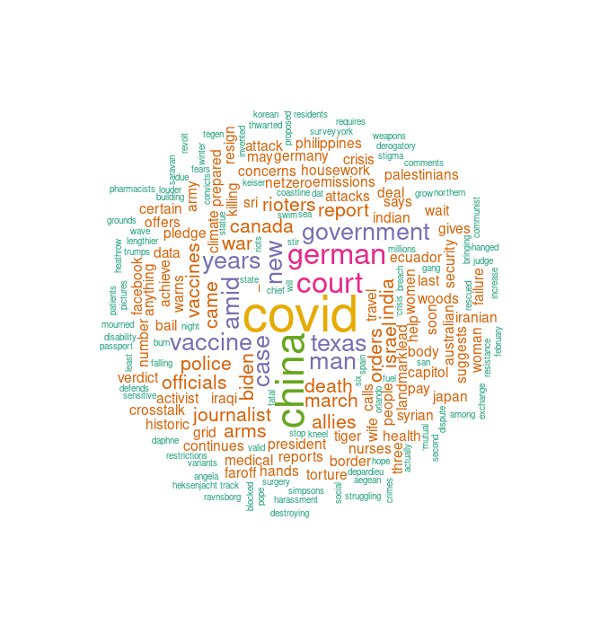

# Getting started

In this post we'll look at webscraping in R, which can be a useful way to automate collection of data from online sources if you want to make your own datasets. Let's start by importing the required packages: `dplyr`, `compiler` and `rvest`:

```r {linenos=inline}
library(dplyr) # Bestows upon us the piping '%>%' operator
library(compiler) # Compiles our functions
library(rvest) # Includes functions we need for webscraping
```

### Writing the scraping functions

This function will take two arguments, the `URL` of the website that you want to scrape data from, and it's corresponding `css element`.

If you want to re-run this script multiple times, we can just add an `if` statement to check if the function exists instead of creating it and compiling it every time we want to run the script.

```r {linenos=inline}
# If the fetch function isn't loaded, load it
if(!exists("fetch", mode="function")){
  # function to fetch data
  fetch <- function(url, element){
    webpage <- read_html(url)
    newsdata <- html_nodes(webpage, element)
    text_data <- html_text(newsdata)
    text_data <- text_data[!duplicated(text_data)]
  }
  
  # compile fetch function
  fetch <- cmpfun(fetch)
}
```

### Scraping the data

Let's scrape some text from a few news sites and use this to create a wordcloud of today's news headlines. Note that these elements are bound to change over time so the css emelents might need to be updated in the future.

```r {linenos=inline}
# fetch the data
reddit_world_data <- fetch(url = 'https://old.reddit.com/r/worldnews/new/', element = '.outbound')
redditnews_data <- fetch(url = 'https://old.reddit.com/r/news/new/', element = '.outbound')
bbcnews_data <- fetch(url = 'https://www.bbc.com/news/world', element = '.gel-pica-bold')
ajznews_data <- fetch(url = 'https://www.aljazeera.com/news/', element = '.gc__title')
rt_newsdata <- fetch(url = 'https://www.rt.com/news/', element = '.link_hover')
```

Now, as this is raw data we've just collected, it'll require some processing, so lets clean it up:

```r {linenos=inline}
# rt
rt_newsdata <- rt_newsdata[1:17] %>%
  trimws()
  
# bbc
bbcnews_data <- sub('.*seconds|.*second', '', bbcnews_data)
bbcnews_data <- bbcnews_data[!duplicated(bbcnews_data)]

# ajz
ajznews_data <- ajznews_data[!duplicated(ajznews_data)]

# reddit
reddit_world_data <- reddit_world_data[!duplicated(reddit_world_data)]

redditnews_data <- redditnews_data[!duplicated(redditnews_data)]
```

### Making the wordcloud

First, let's import the packages we'll need to make the wordcloud and set the seed to ensure reproducibility:

```r {linenos=inline}
set.seed(123)
library(tm) # functions for creating and cleaning the corpus
library(wordcloud)
```

Now we can use the text data that we've scraped to create our wordcloud. We'll need to first combine all of the text into a single character vector, convert this to a corpus for cleaning, then once we have our cleaned text data we can create a document term matrix to count the frequency of each word in our wordcloud and covert this to a dataframe.

```r {linenos=inline}
# add all data to a single vector
text <- c(ajznews_data, bbcnews_data,  rt_newsdata, reddit_world_data, redditnews_data)

# create a corpus using the text vector
docs <- Corpus(VectorSource(text))

# process the data for the wordcloud
docs <- docs %>%
  tm_map(removeNumbers) %>%
  tm_map(removePunctuation) %>%
  tm_map(stripWhitespace) %>%
  tm_map(content_transformer(tolower)) %>%
  tm_map(removeWords, stopwords("english"))

# create a document term matrix using the cleaned corpus
dtm <- TermDocumentMatrix(docs) 
matrix <- as.matrix(dtm) 

# sort words by frequency
words <- sort(rowSums(matrix),decreasing=TRUE) 
df <- data.frame(word = names(words),freq=words)

# make the wordcloud
wordcloud(words = df$word, 
          freq = df$freq, 
          min.freq = 1,
          max.words=200, 
          random.order=FALSE,
          scale=c(3.5, 0.25),
          rot.per=0.35,
          colors=brewer.pal(6, "Dark2"))
```

Here's the final result!

